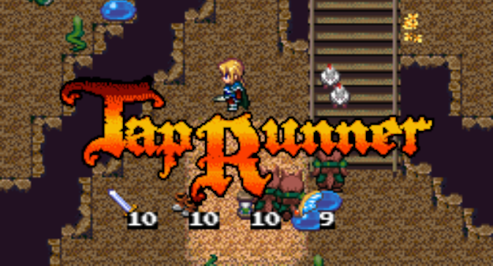

Tap Runner
==========

遊び方
------

タップするたびに方向転換する主人公を操って、
画面上部のゴールを目指します。

宝箱に入っているアイテムを取るとパワーアップします。
穴に落ちるか時間切れになるとゲームオーバーです。

20面クリアで1周目のエンディング、
40面クリアで真のエンディングになります。

なお、スワイプ操作はありません。

### ⇒[***Tap Runnerで遊ぶ***](./taprunner.pwa.html)

動作環境など
------------

Tap Runner はJavaScriptで開発しています。
PCやスマートフォンのブラウザで遊べます。

TODO: PWA対応していますので、ホームに追加してオフラインで遊ぶこともできます。

ライブラリ、素材
----------------

* 画像素材
  * First seed material
* 効果音素材
  * [魔王魂](https://maou.audio/)
  * [ザ・マッチメイカァズ](http://osabisi.sakura.ne.jp/m2/)
* ロゴジェネレータ
  * [Cool Text](https://ja.cooltext.com/)
* ゲームエンジン
  * [phina.js](https://phinajs.com/)

### ⇒[***Tap Runnerで遊ぶ***](./taprunner.pwa.html)
